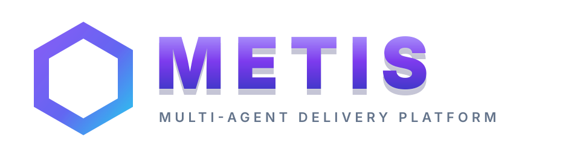

<div align="center">
  

  <p><strong>把需求、执行、质检与交付组织成可追踪的多 Agent 工作流</strong></p>

  <p>
    <a href="https://metis-multiagent.up.railway.app"></a>
    
    
    
    <a href="LICENSE"></a>
  </p>
</div>

---

## 项目简介

METIS 是一个面向软件项目交付的多 Agent 协作平台。用户与 PM Agent 确认需求和阶段计划后，系统组织专业 Agent 执行任务、管理共享工作区，并通过阶段 QA/QC、Final QA/QC 和签收链路记录交付证据。

当前交付形态为 **Web 应用**；桌面端本地存储能力仅作预留，尚未发布。

## 核心能力

- **需求与阶段规划**：从想法讨论、需求确认到可执行的阶段任务。
- **多 Agent 执行**：按专家角色分配任务，存在文件交集时自动调整执行波次。
- **质量闭环**：阶段 QA/QC、问题聚合返修、重复缺陷移交与最终验收。
- **全站工程师工作台**：项目咨询、功能变更讨论、代码整改和定向复检。
- **项目数据与工作区持久化**：PostgreSQL 保存业务状态，持久化卷保存项目工作区。
- **项目级 Git 同步**：每个项目可独立绑定 GitHub 或 Gitee 仓库，Token 加密保存。
- **MCP 服务**：支持为外部客户端签发具名 Token，并按用户和项目隔离访问。
- **可观测数据看板**：按项目聚合 Token 消耗、Agent 执行时长和交付文件数量。

## 工作流程

```text
想法落地 → 总 PM 需求确认 → 阶段 PM 规划 → 专家 Agent 执行
       → 阶段 QA/QC → 阶段确认 → Final QA/QC → 项目签收
                              ↘ 重复缺陷 → 全站工程师整改
```

## 技术栈

| 层级 | 技术 |
|:---|:---|
| Web 前端 | React 18 · TypeScript · Ant Design 5 · Vite 6 · Zustand |
| 后端 | Python 3.10+ · FastAPI · Uvicorn · Pydantic |
| 数据 | PostgreSQL（生产）· SQLite（本地测试）· 持久化项目工作区 |
| 网关与部署 | Nginx · Docker · Railway |
| 安全 | HttpOnly JWT · PBKDF2-SHA256 · Fernet 加密 · 限流与审计 |
| 集成 | OpenAI 兼容模型 API · MCP · GitHub/Gitee |

## 环境要求

| 使用方式 | 必要环境 |
|:---|:---|
| Docker（推荐） | Docker Engine / Docker Desktop · Docker Compose v2 · 至少 2 GB 可用内存 |
| 源码运行 | Python 3.10+ · Node.js 18+ · npm 9+ · Git 2.x |
| 生产数据 | PostgreSQL 16（推荐）· 可写的 `/var/data` 持久化目录 |
| 本地开发 | SQLite 可作为开发回退；不代表 PostgreSQL 生产行为已验证 |

项目执行需要用户在“设置 → API 配置”中提供兼容的模型名称、API Base URL 和 API Key。模型凭据按用户隔离并加密保存，不应写入 `.env` 或仓库。

## 快速开始

### Docker Compose

```powershell
git clone https://github.com/Felix-0625/METIS-MultiAgent.git
Set-Location METIS-MultiAgent
Copy-Item .env.example .env
# 编辑 .env，至少设置数据库密码、管理员密码、JWT 与数据加密密钥
docker compose up --build -d
```

部署前请阅读 [部署指南](docs/DEPLOYMENT.md)，不要提交 `.env`、API Key、仓库 Token 或数据库文件。

### 生产环境关键配置

| 变量 | 要求 |
|:---|:---|
| `DATABASE_URL` | PostgreSQL 连接地址；生产环境必填 |
| `REQUIRE_DATABASE_URL` | 生产环境设为 `true`，禁止静默回退 SQLite |
| `METIS_DATA_DIR` | Railway/Docker 使用 `/var/data` |
| `JWT_SECRET` | 至少 32 UTF-8 字节的稳定随机密钥 |
| `METIS_DATA_ENCRYPTION_KEY` | 至少 32 UTF-8 字节；用于加密 API Key、Git Token 等敏感配置 |
| `ADMIN_USERNAME` / `ADMIN_PASSWORD` | 初始管理员账号；密码必须自行设置 |
| `CORS_ORIGINS` | 只填写实际允许访问的 Web 域名 |
| `DB_SSLMODE` | 托管 PostgreSQL 通常使用 `require` |
| `BREVO_API_KEY` / `BREVO_SENDER_EMAIL` | 邮件验证可选；也可改用完整的 `SMTP_*` 配置 |

密钥生成示例：

```powershell
# 生成 64 个十六进制字符（32 字节随机数据）
python -c "import secrets; print(secrets.token_hex(32))"
```

### 本地开发

```powershell
python -m venv .venv
.\.venv\Scripts\Activate.ps1
python -m pip install -r backend\requirements.txt

Set-Location backend
python -m uvicorn main:app --reload --host 0.0.0.0 --port 8000
```

另开终端启动前端：

```powershell
Set-Location frontend
npm ci
npm run dev
```

- Web 前端：`http://localhost:3000`
- 后端健康检查：`http://localhost:8000/health`
- OpenAPI：`http://localhost:8000/docs`

## Railway 部署摘要

1. 使用本仓库根目录的 `Dockerfile` 构建 Web Service。
2. 添加 Railway PostgreSQL，并将 `DATABASE_URL` 引用到 Web Service。
3. 创建 Volume，挂载路径固定为 `/var/data`。
4. 配置上表中的生产环境变量，健康检查路径设为 `/health`。
5. 将服务连接到本仓库 `main` 分支；推送后由 Railway 自动构建部署。

当前公开地址：[https://metis-multiagent.up.railway.app](https://metis-multiagent.up.railway.app)

## 验证

```powershell
python -m pytest backend\tests -q
Set-Location frontend
npm run build
```

自动化测试通过不等同于真实模型、生产网络、邮件服务或第三方仓库权限已经可用；上线前仍需完成相应环境的实际验证。

## 项目结构

```text
backend/        FastAPI 路由、Agent、执行与质量引擎
frontend/       React Web 应用
docs/           架构、接口、部署和使用文档
prompts/        Agent 提示词
skills/         各角色 Skill 定义
宣传网页/       产品首页
Dockerfile      Railway 单容器生产镜像
docker-compose.yml
```

## 文档导航

- [使用指南](docs/USER_GUIDE.md)
- [系统架构](docs/ARCHITECTURE.md)
- [API 接口](docs/API.md)
- [Railway 与 Docker 部署](docs/DEPLOYMENT.md)
- [安全策略](SECURITY.md)
- [版本变更](CHANGE.md)
- [开源许可证](LICENSE)

## 安全说明

- API Key、Git Token 和 MCP Token 不应写入代码或提交到仓库。
- 生产环境必须提供稳定且足够强的 `JWT_SECRET` 与 `METIS_DATA_ENCRYPTION_KEY`。
- Git 拉取会修改所选项目工作区，执行前应确认远端仓库和本地改动。
- 安全问题请按照 [SECURITY.md](SECURITY.md) 中的方式报告。

## 许可证

[MIT License](https://github.com/Felix-0625/METIS-MultiAgent/blob/main/LICENSE) © 2026 Felix-0625
