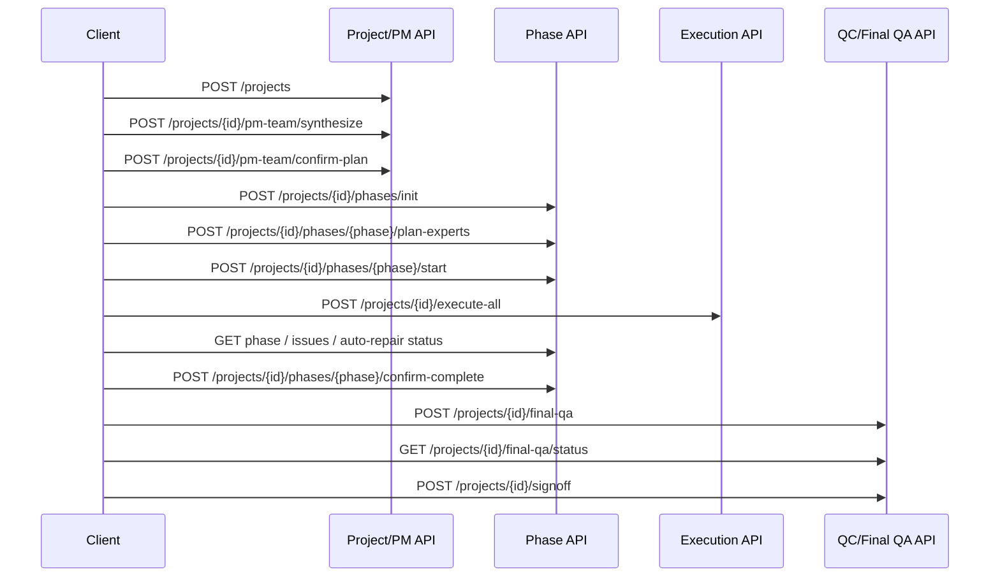

# METIS 接口文档

## 1. 文档定位

METIS 后端使用 FastAPI 自动生成 OpenAPI。本文说明稳定的接入约定、核心工作流接口和路由分组；字段级请求/响应模型以运行实例生成的 OpenAPI 为准。

| 资源 | 默认地址 |
|---|---|
| REST API | `http://localhost:8000` |
| Swagger UI | `http://localhost:8000/docs` |
| ReDoc | `http://localhost:8000/redoc` |
| OpenAPI JSON | `http://localhost:8000/openapi.json` |
| WebSocket | `ws://localhost:8000/ws/{project_id}` |

生产环境应使用同源 HTTPS/WSS 地址，不应写死本地端口。

## 2. 通用约定

### 2.1 数据格式

- 默认请求和响应类型为 `application/json; charset=utf-8`。
- 文件上传使用 `multipart/form-data`，文件下载返回流式响应。
- 时间字段使用 ISO 8601；标识符按接口模型使用字符串。
- 路径中的 `{project_id}` 必须属于当前登录用户。

### 2.2 认证

认证优先级：

1. `Authorization: Bearer <JWT>`
2. 登录接口设置的 HttpOnly Cookie

浏览器客户端默认使用 Cookie；MCP、脚本和外部客户端可使用 Bearer Token。除下列公开接口外，其余接口默认需要认证：

| 方法 | 路径 | 说明 |
|---|---|---|
| `GET/HEAD` | `/` | 存活探测 |
| `GET/HEAD` | `/health` | 应用与数据库健康检查 |
| `POST` | `/auth/login` | 登录 |
| `POST` | `/auth/logout` | 退出 |
| `POST` | `/auth/register` | 注册 |
| `POST` | `/auth/verify-email` | 邮箱验证 |
| `POST` | `/auth/resend-verification` | 重发验证码 |
| `POST` | `/auth/forgot-password` | 发起密码重置 |
| `POST` | `/auth/reset-password` | 完成密码重置 |

### 2.3 幂等与并发

- 创建项目和单 Agent 执行支持 `Idempotency-Key` 请求头。
- 客户端应为一次逻辑操作生成 UUID，并在网络重试时复用同一个值。
- 阶段规划、确认、返工和文件写入可能包含版本或状态前置条件；`409 Conflict` 表示调用方必须重新读取最新状态后再决定是否重试。
- 不得并发提交同一阶段的互斥状态转换。

### 2.4 状态码

| 状态码 | 含义 |
|---|---|
| `200/201` | 请求成功或资源已创建 |
| `202` | 已接受后台任务，需轮询状态接口 |
| `400` | 请求或业务输入无效 |
| `401` | 未认证或令牌失效 |
| `403` | 无项目/资源权限 |
| `404` | 资源不存在 |
| `409` | 状态、版本、幂等键或文件写入冲突 |
| `413` | 请求体或上传文件过大 |
| `422` | FastAPI/Pydantic 参数校验失败 |
| `429` | 超过限流额度 |
| `500` | 未处理的服务端错误 |
| `501` | 当前环境未配置所需外部能力 |
| `503` | 数据库或关键依赖不健康 |

标准错误至少包含：

```json
{
  "detail": "错误说明"
}
```

工作流门禁接口可能返回结构化 `blockers`、`issues` 或 `release_gate_error`；客户端不得只解析文本。

## 3. 核心业务流程



所有异步阶段都应轮询权威状态接口直至终态；固定时长等待不能作为完成判断。

## 4. 核心接口

### 4.1 认证与用户

| 方法 | 路径 | 说明 |
|---|---|---|
| `POST` | `/auth/login` | 登录并设置 HttpOnly Cookie |
| `POST` | `/auth/logout` | 清除登录 Cookie |
| `GET` | `/auth/me` | 当前用户信息 |
| `PUT` | `/auth/change-password` | 修改密码 |
| `GET` | `/auth/users` | 用户列表，仅管理员 |
| `DELETE` | `/auth/users/{user_id}` | 删除用户，仅管理员 |

### 4.2 项目与文件

| 方法 | 路径 | 说明 |
|---|---|---|
| `POST` | `/projects` | 创建项目；支持 `Idempotency-Key` |
| `GET` | `/projects` | 当前用户的项目列表 |
| `GET` | `/projects/{project_id}` | 项目详情 |
| `PATCH` | `/projects/{project_id}` | 更新项目 |
| `DELETE` | `/projects/{project_id}` | 删除项目 |
| `GET` | `/projects/{project_id}/files` | 文件树 |
| `GET` | `/projects/{project_id}/files/read` | 读取文件 |
| `POST` | `/projects/{project_id}/files/write` | 写入文件 |
| `DELETE` | `/projects/{project_id}/files/delete` | 删除文件 |
| `GET` | `/projects/{project_id}/files/download` | 下载单个文件 |
| `GET` | `/projects/{project_id}/archive/download` | 下载服务端项目归档 |
| `GET` | `/projects/{project_id}/files/versions` | 文件版本记录 |
| `POST` | `/projects/{project_id}/files/rollback` | 回滚文件版本 |

文件参数、版本前置条件和下载响应头以 OpenAPI 为准。路径必须是项目工作区内的相对路径。

### 4.3 PM 与规划

| 方法 | 路径 | 说明 |
|---|---|---|
| `POST` | `/projects/{project_id}/pm-team/chat` | PM 团队对话 |
| `POST` | `/projects/{project_id}/pm-team/collect-analyses` | 收集成员分析 |
| `POST` | `/projects/{project_id}/pm-team/synthesize` | 生成总计划 |
| `POST` | `/projects/{project_id}/pm-team/confirm-plan` | 确认总计划 |
| `GET` | `/projects/{project_id}/pm-team/plan` | 获取当前权威计划 |
| `POST` | `/projects/{project_id}/phases/init` | 从已确认计划初始化阶段 |

### 4.4 阶段、执行与恢复

| 方法 | 路径 | 说明 |
|---|---|---|
| `GET` | `/projects/{project_id}/phases` | 阶段列表 |
| `GET` | `/projects/{project_id}/phases/{phase_id}` | 阶段详情 |
| `POST` | `/projects/{project_id}/phases/{phase_id}/pm-chat` | 阶段 PM 对话与规划 |
| `POST` | `/projects/{project_id}/phases/{phase_id}/plan-experts` | 生成并校验专家任务计划 |
| `POST` | `/projects/{project_id}/phases/{phase_id}/start` | 启动阶段 |
| `POST` | `/projects/{project_id}/agents/{agent_id}/execute` | 执行单个 Agent |
| `POST` | `/projects/{project_id}/execute-all` | 执行当前可运行任务 |
| `GET` | `/projects/{project_id}/runs` | 执行记录 |
| `GET` | `/projects/{project_id}/runs/{run_id}` | 单次运行状态 |
| `POST` | `/projects/{project_id}/runs/{run_id}/cancel` | 取消运行 |
| `POST` | `/projects/{project_id}/runs/{run_id}/takeover` | 人工接管 |
| `POST` | `/projects/{project_id}/runs/{run_id}/resolve` | 处理接管结果 |
| `GET` | `/projects/{project_id}/phases/{phase_id}/issues` | 阶段问题 |
| `GET` | `/projects/{project_id}/phases/{phase_id}/auto-repair/status` | 自动返工状态 |
| `POST` | `/projects/{project_id}/phases/{phase_id}/auto-repair` | 启动自动返工 |
| `POST` | `/projects/{project_id}/phases/{phase_id}/auto-repair/resume` | 恢复中断返工 |
| `POST` | `/projects/{project_id}/phases/{phase_id}/confirm-complete` | 确认阶段完成 |

### 4.5 QC、Final QA 与签收

| 方法 | 路径 | 说明 |
|---|---|---|
| `POST` | `/projects/{project_id}/qc/trigger` | 触发指定范围 QC |
| `POST` | `/projects/{project_id}/qc/trigger-all` | 触发项目 QC |
| `GET` | `/projects/{project_id}/qc/results` | QC 结果 |
| `GET` | `/projects/{project_id}/qc/results/{subproject_id}` | 子项目 QC 结果 |
| `POST` | `/projects/{project_id}/final-qa` | 启动最终验收 |
| `GET` | `/projects/{project_id}/final-qa/status` | 最终验收状态 |
| `GET` | `/projects/{project_id}/signoff/status` | 只读签收就绪状态 |
| `POST` | `/projects/{project_id}/signoff` | 执行最终签收 |

`Final QA` 通过不等于已经签收。调用方必须再检查签收状态并执行 `POST /signoff`。

## 5. 其他路由分组

当前代码注册 27 个路由模块，共约 221 个 HTTP/WebSocket 路由声明。以下为完整能力分组；具体路径、参数和模型在 Swagger/ReDoc 中查询。

| 分组 | 路由模块 | 路由数 | 能力 |
|---|---|---:|---|
| adjustments | `routes_adjustments.py` | 10 | 调整、恢复、Final QA |
| auth | `routes_auth.py` | 11 | 登录、注册、用户管理 |
| basic | `routes_basic.py` | 2 | 基础状态 |
| chat | `routes_chat.py` | 3 | Agent 对话历史 |
| config | `routes_config.py` | 5 | 模型/API 配置与缓存 |
| data | `routes_data.py` | 2 | 数据导入导出 |
| employee | `routes_employee.py` | 16 | 成员池与工作配置 |
| engineer | `routes_engineer.py` | 14 | 工程师接管与修复 |
| execution | `routes_execution.py` | 8 | Agent 和运行生命周期 |
| experts | `routes_experts.py` | 21 | 专家池、记忆与训练 |
| files | `routes_files.py` | 12 | 文件、版本和归档 |
| gitee | `routes_gitee.py` | 5 | Gitee 同步 |
| hr | `routes_hr.py` | 5 | 团队组建与改派 |
| idea_landing | `routes_idea.py` | 15 | 想法落地与需求文档 |
| mcp | `routes_mcp.py` | 2 | MCP 工具调用 |
| metrics | `routes_metrics.py` | 2 | 指标 |
| misc | `routes_misc.py` | 6 | 辅助接口 |
| phases | `routes_phases.py` | 22 | 阶段规划、执行、返工和锁 |
| pm | `routes_pm.py` | 14 | 总体规划 |
| projects | `routes_projects.py` | 5 | 项目 CRUD |
| reliability | `routes_reliability.py` | 1 | 可靠性审计 |
| repair | `routes_repair.py` | 9 | 修复任务 |
| skills | `routes_skills.py` | 13 | 技能池与导入 |
| subprojects | `routes_subprojects.py` | 2 | 子项目分配 |
| supervisor | `routes_supervisor.py` | 11 | QC、签收与监督 |
| team | `routes_team.py` | 4 | 团队状态 |
| websocket | `websocket.py` | 1 | 项目实时频道 |

## 6. WebSocket

连接：

```text
ws(s)://<host>/ws/{project_id}
```

- 浏览器默认通过 HttpOnly Cookie 认证。
- 服务端校验 `Origin`、用户身份、项目存在性和项目所有权。
- 消息用于提示“服务端状态已变化”，不作为最终业务状态。
- 客户端断线后使用指数退避重连，并通过 REST 轮询兜底。
- 客户端收到事件后应重新获取项目、阶段或 Agent 的权威状态。

## 7. 接入要求

1. 登录后先调用 `GET /auth/me` 确认会话。
2. 所有项目请求都使用服务端返回的 `project_id`，不要自行推导。
3. 写操作处理 `409`、`422`、`429` 和网络重试。
4. 后台任务通过状态接口轮询到明确终态。
5. 文件下载必须使用服务端下载接口，不以浏览器内存 Blob 代替持久交付。
6. 不记录 Cookie、Bearer Token、API Key 或完整敏感配置。
7. OpenAPI 与本文冲突时，以当前运行实例的 OpenAPI 和服务端状态机门禁为准。
