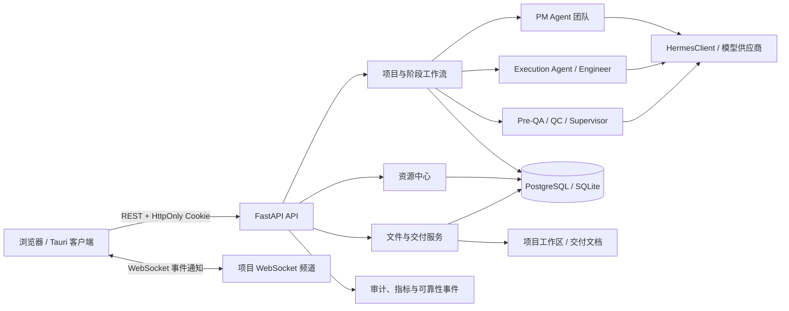
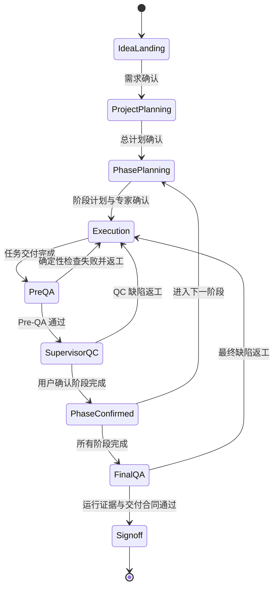

# METIS 系统架构说明

## 1. 文档范围

本文描述当前本地工作区中的 METIS 架构，包括尚未提交的交付合同与质量闭环重构。接口约定见 [API.md](API.md)。

METIS 是一个以项目为隔离单元的多 Agent 软件交付系统。系统把需求澄清、项目规划、专家分配、阶段执行、质量检查、返工、运行验收和最终签收组织为可持久化、可恢复的工作流。

## 2. 总体架构



### 2.1 技术栈

| 层次 | 主要技术 | 职责 |
|---|---|---|
| Web 前端 | React 18、TypeScript、Vite、Ant Design、Zustand | 项目管理、阶段看板、资源中心、设置与实时状态 |
| 桌面端 | Tauri | 复用 Web 前端并接入桌面平台能力 |
| API | FastAPI、Pydantic、Uvicorn | REST、OpenAPI、认证、限流、业务编排 |
| 实时通信 | WebSocket | 按项目广播状态变化；HTTP 轮询负责终态兜底 |
| Agent 层 | PM、HR、Execution、Engineer、QC、Supervisor、CCB | 规划、执行、审查和返工 |
| 数据层 | PostgreSQL（生产）、SQLite（本地） | 用户、项目、状态、配置、审计及交付元数据 |
| 工作区 | 本地或持久卷文件系统 | 生成源码、构建产物、交付文档与运行验收材料 |
| 部署 | Docker、Nginx、Caddy、Supervisor、Render | 静态资源、反向代理、TLS、进程管理与持久化 |

## 3. 代码分层

```text
backend/
├── main.py                 # 启动、路由注册、OpenAPI 和全局异常处理
├── api/                    # HTTP/WebSocket 接口及业务用例编排
├── agents/                 # 各类 Agent 的提示、调用与交付实现
├── core/                   # 状态机、合同、持久化、认证和基础服务
├── models/                 # API 与领域数据模型
└── tests/                  # 单元、合同、集成和工作流回归测试

frontend/
├── src/pages/              # 页面与工作流视图
├── src/components/         # 通用界面组件
├── src/services/           # Axios 与 WebSocket 客户端
├── src/platform/           # Web/Tauri 平台适配
└── src-tauri/              # 桌面端配置

prompts/                    # Agent 系统提示和角色知识
skills/                     # 内置技能数据
projects/                   # 本地项目工作区（默认路径之一）
data/                       # 本地持久化与快照（默认路径之一）
```

依赖方向应保持为 `api -> core/agents/models`，`agents -> core/models`。`core` 不应依赖具体页面或 HTTP 表现层。

## 4. 核心领域与职责

| 领域 | 主要模块 | 说明 |
|---|---|---|
| 应用状态 | `core/app_state.py`、`core/project_context.py` | FastAPI 实例、项目上下文、共享资源与启动恢复 |
| 项目/阶段 | `core/phase_manager.py`、`api/routes_pm.py`、`api/routes_phases.py` | 总计划、阶段计划、专家分配、执行和确认 |
| 执行合同 | `core/phase_execution_contract.py`、`agents/execution_agent.py` | 任务范围、角色、依赖、必需文件和交付校验 |
| 交付文档 | `core/delivery_documents.py` | 文件责任人、哈希、历史、依赖和写入冲突控制 |
| 质量合同 | `core/qc_review_contract.py`、`core/pre_qa_verifier.py` | QC 审查包、验收标准和确定性检查 |
| 质量状态机 | `core/supervisor_quality_state.py`、`api/routes_supervisor.py` | QC 生命周期、缺陷状态与 Supervisor 决策 |
| 返工闭环 | `core/repair_loop.py`、`api/routes_adjustments.py` | 精准返工、重试预算、恢复和 Final QA |
| 运行验收 | `core/runtime_acceptance.py` | 在隔离环境中验证构建、启动及业务运行证据 |
| 身份与隔离 | `core/auth.py`、`core/user_scope.py` | JWT/Cookie 认证、管理员权限、用户资源隔离 |
| 持久化 | `core/database.py`、`core/persistence.py` | 数据库迁移、事务写入、状态恢复和快照 |
| 模型访问 | `core/hermes_client.py` | 供应商配置、模型兼容、结构化响应与错误分类 |

## 5. 主工作流



### 5.1 规划

1. Idea Landing 保存对话、用户记忆和需求文档。
2. PM 团队生成总计划并持久化项目合同。
3. 阶段 PM 基于已确认总计划生成阶段任务。
4. 每个任务绑定专家、执行角色、技术要求和依赖关系。
5. 阶段启动前校验专家仍存在、资源池版本有效且任务合同完整。

### 5.2 执行与交付

1. 调度器按依赖和锁状态启动 Agent。
2. Execution Agent 只可写入合同允许的路径。
3. 写入前校验路径安全、文件责任、依赖基线和写入意图。
4. 成功交付后生成文件级权威记录，包括哈希、创建者、当前责任人和历史。
5. WebSocket 只发送状态变化通知；客户端通过 REST 重新读取权威快照。

### 5.3 质量与签收

1. Pre-QA 运行确定性构建、测试和合同检查。
2. QC 审查包绑定任务、文件、责任人、验收标准和 Pre-QA 证据。
3. Supervisor 对缺陷分类并路由到有权限的责任人。
4. Final QA 合并静态审查、运行时验收和返工结果。
5. Signoff 只在交付文档有效、无开放返工且所有门禁通过时完成；失败返回结构化阻塞项。

## 6. 状态、一致性与并发

- 项目、阶段、任务、质量运行和签收均以服务端持久化状态为准。
- 状态转换由显式门禁控制，不依赖模型自然语言判断是否完成。
- 执行使用项目、阶段、任务和文件级锁；无明确路径的任务采用更保守的串行范围。
- 幂等写接口使用 `Idempotency-Key` 或内部稳定键防止重复创建和重复执行。
- 文件交付通过内容哈希、责任归属和完整基线检查防止静默覆盖。
- 事务失败必须回滚业务状态；服务重启后从持久化状态恢复未完成流程。

## 7. 数据与存储

### 7.1 数据库

- 生产环境使用 PostgreSQL；本地开发可使用 SQLite。
- `REQUIRE_DATABASE_URL=true` 时数据库不可用必须启动失败，禁止静默降级。
- `core/database.py` 负责初始化、版本化迁移、连接健康检查和事务操作。

### 7.2 文件系统

- `METIS_DATA_DIR` 指定持久化根目录；容器部署通常挂载到 `/var/data`。
- 项目工作区保存生成文件和验收材料，数据库保存权威状态与索引。
- API Key 等敏感配置必须加密存储，禁止写入源码、日志或版本库。
- 临时测试、构建缓存和模糊测试产物不是交付数据，不应进入版本控制。

## 8. 安全边界

- HTTP 认证优先使用 Bearer Token，其次使用 HttpOnly Cookie。
- WebSocket 独立校验 Cookie/Token、Origin、项目所有者和访问权限。
- 中间件统一执行认证、CORS、读写分桶限流和请求体大小限制。
- 所有项目接口必须校验当前用户对 `project_id` 的所有权。
- 文件接口必须规范化路径并限制在项目工作区内，拒绝绝对路径和目录穿越。
- 管理员接口使用独立的角色门禁。
- 全局异常处理隐藏内部堆栈，仅在服务端记录诊断信息。

## 9. 部署拓扑

### 9.1 本地开发

```text
Browser/Tauri -> Vite (:3000) -> FastAPI (:8000) -> SQLite/PostgreSQL
                                      └──────────> 本地项目工作区
```

### 9.2 Docker Compose

```text
Internet -> Caddy (TLS) -> Nginx/Frontend
                         -> FastAPI
FastAPI -> PostgreSQL
FastAPI -> metis_data 持久卷
```

### 9.3 Render 单服务

`Dockerfile.render` 构建前端并将 Nginx、FastAPI 和 Supervisor 放入同一服务容器；PostgreSQL 使用外部托管实例，持久文件写入挂载卷。Nginx 监听平台注入的端口并反向代理 API 与 WebSocket。

## 10. 可观测性与验证

- `/health` 同时检查应用和数据库健康状态。
- 审计、指标、执行运行记录、QC 结果和可靠性事件均提供查询接口。
- 关键工作流测试覆盖规划合同、交付文档、状态迁移、并发写入、运行验收、Final QA 和 Signoff。
- 生产验收必须验证真实持久化、重启恢复和服务端交付，不以单次 HTTP 200 或前端提示代替。

## 11. 当前架构风险

- `routes_phases.py`、`routes_adjustments.py` 和 `execution_agent.py` 体积较大，业务编排与领域逻辑仍有耦合，后续应按合同边界渐进拆分。
- 部分资源池仍包含文件快照路径；多实例并发写入必须依赖数据库事务、版本号或分布式锁。
- 工作区文件与数据库元数据是双存储模型，任何写入都必须保持原子性或具备可恢复补偿。
- 当前本地大规模重构尚未提交，不能视为已发布或已与远程分支完成集成。
